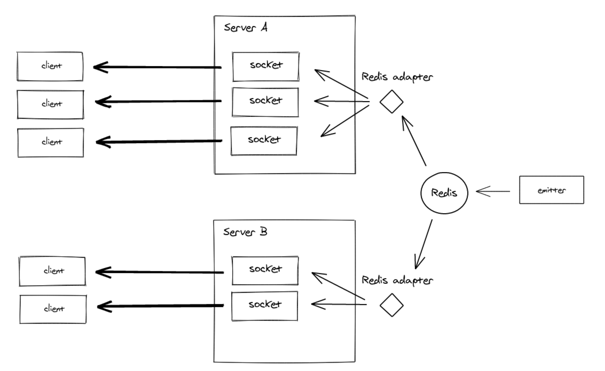

# Socket

## Architecture

Multi-node socket communication

The adapter now is `Postgresql` or `Redis`

## Scenes

1. In the Story page, notify the client of the online user who is currently browsing the story

2. When another user modifies a block, notify the user who is currently browsing the block and update the content of the block in real time

3. Client broadcast events
